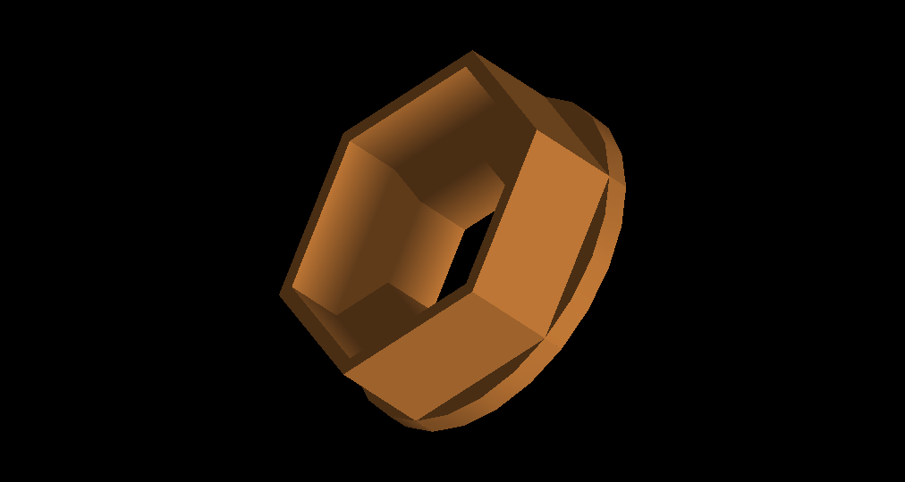
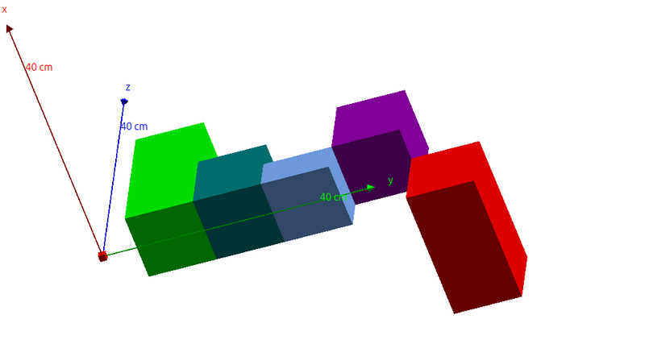
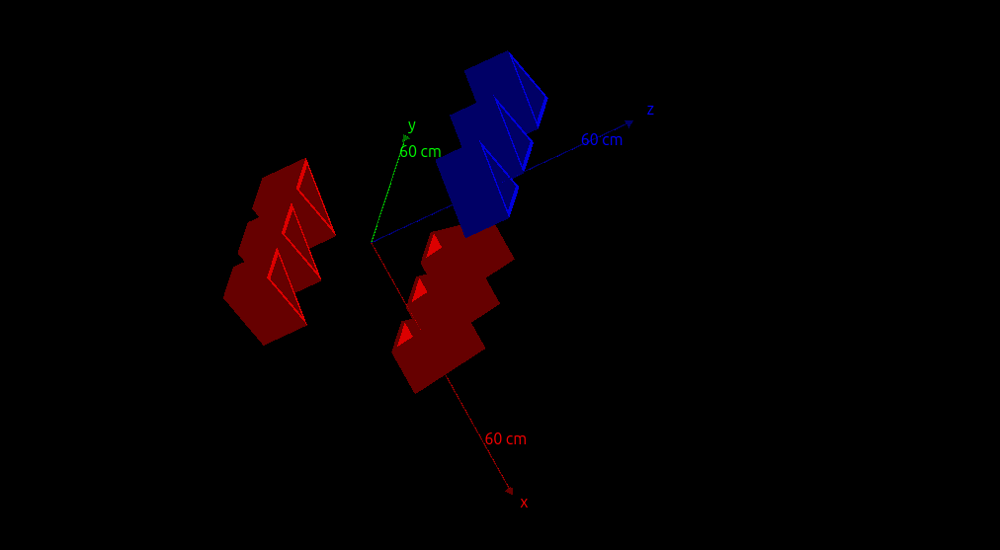
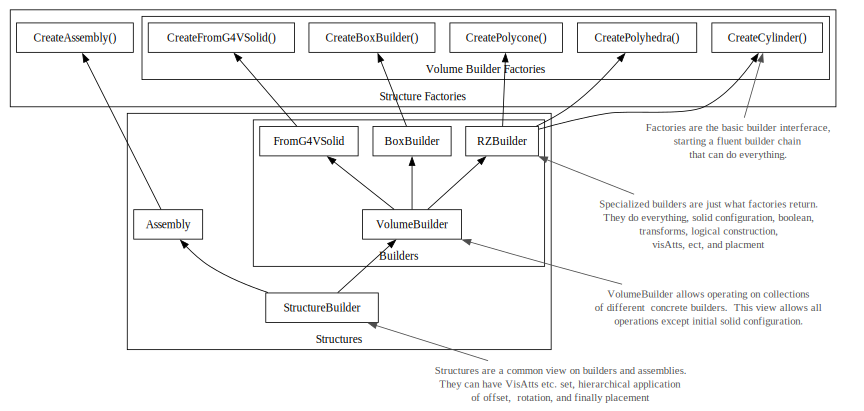

[To Doug Leonard's other pages](https://douglas_s_leonard.gitlab.io/pages)


[TOC]
#DLG4::VolumeBuilders
README for VolumeBuilders  code (and readme) Copyright Doug Leonard 2025, All rights reserved.

Distributed under MIT (Expat) license.

[The git code repo](https://gitlab.com/douglas_s_leonard/physics_utilities/VolumeBuilders)

[The Doxygen documentation page (if you're not already there)](https://douglas_s_leonard.gitlab.io/physics_utilities/VolumeBuilders/)


## Introduction

VolumeBuilders is a fluent-style (ie chained) builder system for simplified and streamlined definition of Geant4 geometries, aimed at simplifying geometry definition and removing code noise to focus on configuration, with a result of easier definition and review and fewer bugs.  As a bonus, it allows easy definition of assemblies containing other assemblies and volumes, treating both in the same way, simply as objects to be configured (visibility etc) or placed.  

Some benefits/features include:
- Full doxygen documentation with hover docs and parameter hints, preconfigured for JetBrains clion IDE.
- Definition of solid planes relative to arbitrary origins simplifies placement/overlap.
- Much reduced repetition of units, parameters, types, and variable names
- Ex: copy and place loops specify only what is changing (position for instance), easing comprehension.  Noise hides bugs.      
- Far fewer temporary object declarations, 
- Omission of defaulted configs (offsets, rotations, etc)
- Automated logical/phsyical suffix naming and configurable copy naming/numbering.
- Simplified hierarchical assemblies with simplified reflection planned.
- It is fully interoperable with standard geant classes/methods, and thus is gradually adoptable/implementable.  

## Primary References
1. The examples below are probably the 1st choice
2. **[Factories](@ref Factories)**, and specifically solid builder factories, are the primary visible/starting interface to VolumeBuilder and are documented in the linked page.
3. [VolumeBuilder methods](@ref DLG4::VolumeBuilders::VolumeBuilder) documents methods available for all builders. They can be chained to configure things like booleans, the logical volumes and placements.   
4. **[Builder classes](@ref Builders)** documentation additionally include builder-specific methods, depending on the factory used.  There aren't many, but RZBuilder (used by CreatePolyCone() and CreatePolyHedra) has a few. 
5. Hover text and parameter hints are available for all methods if using a modern IDE.  CLion is highly recommended and supported. 
6. **[Assembly](@ref DLG4::VolumeBuilders::Assembly())**, a structure [StructureView](@ref StructureBuilder), and more are documented in the general Doxygen class listings.  
7. **[the Topics page](topics.html)** groups listings of  classes, methods, etc by purpose, etc. 


The best references are examples like those in sections below. In general the **[Factories](@ref Factories)**, and specifically solid builder factories, are the primary visible/starting interface to VolumeBuilder and are documented in the linked page.  [VolumeBuilder methods](@ref DLG4::VolumeBuilders::VolumeBuilder)  methods can be chained to configure things like booleans, the logical volumes and placements.   Some builder-specific properties are configurable after factory construction and are documented by the **[builder class](@ref Builders)** related to the factory. This is particularly true for RZBuilder. Hover text and parameter hints are available for all methods if using a modern IDE.  CLion is highly recommended and supported. Doxygen documentation is also available for an **[Assembly](@ref DLG4::VolumeBuilders::Assembly())**, a structure [StructureView](@ref StructureBuilder), and more.  Groups of classes, methods, etc of interest will be documented in **[the Topics page](topics.html)**

## Hello World
A quick but trivial example.... Here is snippet of a typical world volume setup: 
```cpp
    auto *zero_rot = new G4RotationMatrix();
    auto zero_shift = G4ThreeVector(0, 0, 0); 
    G4double bounding_size = 3. * meter / 2.0;
    auto boxHall = new G4Box("worldbox", bounding_size, bounding_size, bounding_size);
    auto logiHall = new G4LogicalVolume(boxHall, _air, "logiHall");
    auto logiHallVis = new G4VisAttributes(G4Colour(0.8, 0.8, 0.8, 0.1));
    logiHall->SetVisAttributes(logiHallVis);
    logiHall->SetVisAttributes(G4VisAttributes::Invisible);
    G4VPhysicalVolume *physHall =
        new G4PVPlacement(0, zero_shift, logiHall, "world", NULL, false, 0);
    world_phys = physHall;
```
In VolumeBuilder we default rotation, position, mother in this case, and skip all the temporaries and just have:
```cpp
    SetGlobalDefaultUnit(CLHEP::mm);
    world_phys = CreateBoxBuilder("hallbox",3000,3000,3000)
        ->SetMaterial(_air)
        ->SetColor(0.8, 0.8, 0.8, 0.1)
        ->SetVisibility(false)
        ->GetPlacement();
```

## Examples with RZBuilder

VolumeBuilder was originally made as helper utilities for defintions of RZ solids, a powerful alternative to simple cones.   So let's start examples using RZBuilder factories.

RZ solids are nice because they allow defining the z planes of a solid in relation to any fixed z position, including one outside of the solid itself.  For example, the coordinate center can be on the object end face instead of its center.  Then several objects can be positioned with all edges relative to that face, without need for half-length and overlap calculations.  This can eliminating an easy source of bugs and difficult review.

The RZBuilder class in VolumeBuilders leverages this functionality.  The AddPlane method configures a DLG4::VolumeBuilders::RZPlane (A VolumeBuilder) to allow easily adding planes individually.  Units can be set globally ([DLG4::VolumeBuilders::SetGlobalDefaultUnit(CLHEP::cm)](@ref DLG4::VolumeBuilders::SetGlobalDefaultUnit())), per builder (from solid to placement), per solid, per vector, or per value (by setting units to 1).  This also avoids misakes and review in calculations, and awkward variable names like: EC_flange_top_z_mm_no_unit, preventing ommissions or double application of units, which can cause silent bugs.

example:
```cpp
#include <VolumeBuilderIncludes.hh>
//...
RZPlane p;
p.unit = mm;  // ACTUALLY DOES NOTHING in this example.  
                // We could pass an RZPlane (with units), but here we just use it to hold temps.
DLG4::VolumeBuilders::SetGlobalUnit(CLHEP::cm);     // set a global unit

G4Double  lower_can_reference;
auto ring_part = CreatePolyhedraBuilder("ring_part"); 
    ->SetMaterial(_copper)
    ->SetColor(coppertone)  // Can also take (r,g,b,alpha) directly
    ->ForceSolid(true)
    // clang-format-off
    ->AddPlane(p.IR = 50, p.OR = 100, p.z = -10)
    ->AddPlane(p.IR, p.OR, p.z -= 40)
    ->AddPlane(p.IR = 90, p.OR, p.z)
    ->AddPlane(p.IR, p.OR, some_reference = p.z -= 40) //  set a reference for later.
    ->MakePlacement();                         
    // clang-format-on                       

```
Here we used the **[CreatePolyhedtraBuilder()](@ref DLG4::VolumeBuilders::CreatePolyhedraBuilder())**   factory to construct a builder and then configure it.  If you need the logical or physical volume for some reason, you can get it with:
```cpp
auto logical_volume = ring_part -> GetLoogicVolume();
auto physical_volume = ring_part -> GetPlacement();
```

However, you can also pass the buider itself to any function requiring pointer types of 
G4VSolid *, G4VPhysicalVolume*, or G4LogicalVolume*, and the builder will auto convert to the
correct thing!


All methods except GetX() methods return the builder itself, allowing more methods to be chained.
Get() methods generally will call a Make() method if needed.

But VolumeBuilders does much more, it handles the whole Physical volume build chain, as already hinted at by some options above.
Here's how we complete the above example to make a physical volume (a Placement).  See demo/src/geometries/ConstructExample1.cc for the complete example and/or run the Demo and select Example 1 to see the build:

```cpp
#include <VolumeBuilderIncludes.hh>
//...
G4Color coppertone(0.72, 0.45, .2);
RZPlane p;
p.unit = mm; // see prior note.
G4double some_reference;
DLG4::VolumeBuilders::SetGlobalUnit(CLHEP::cm);     // set a global unit

auto ring_part = CreatePolyhedraBuilder("ring_part", 6)
        // can set configurations in any order mostly, but can be nice to set many things up front before geometry details:
        ->SetMaterial(_copper)
        ->SetColor(coppertone) // We can pre-configure the logical-volume!
        ->ForceSolid(true)
        ->AddUnion(another_builder_or_geant_solid, {0, 0, 0}) 
        ->SetMother(another_builder_or_geant_physical_volume)
        // can predefine this. If a builder, it will auto build if needed!
        ->SetDefaultUnit(CLHEP::cm)
        // You can skip things to default them, z-referencing below is enough:
        // ->SetPhysOffset(something)     
        // ->SetPhysRotation(zero_rot)
        // clang-format-off
        ->AddPlane(p.IR = 50, p.OR = 100, p.z = -10)
        ->AddPlane(p.IR, p.OR, p.z -= 40)
        ->AddPlane(p.IR = 90, p.OR, p.z)
        ->AddPlane(p.IR, p.OR, some_reference = p.z -= 40) //  set a reference for later.
        ->MakePlacement();
// clang-format-on

```
Note that the logical volume and physical volume are auto-named to ring_part_L and ring_part_P, respectively.

The full ConstructExample1.cc produces:  
  


## BoxBuilder 
The ability to define parts with arbitrary z-offset was so useful that it has been added
to basic box shapes as well, using the \link DLG4::VolumeBuilders::CreateBoxBuilder()  \endlink method.  The example below from
src/Geometries/ConstructBoxExample.cc demostrates multiple boxes arranged with faces 
set relative to z=0, including one rotated around its offset center.  Select BoxExample from the demo for the live example:

```cpp
    DLG4::VolumeBuilders::SetGlobalDefaultUnit(CLHEP::mm);     // set a global unit
    G4VPhysicalVolume *another_builder_or_geant_physical_volume = world_phys;
    BuilderViewList builder_list;
    // a small box to mark the world center
    auto box_part = CreateBoxBuilder(
        "box_part", // name
        10,   // x total size
        10,   // y total size
        -5,   //  z start
        10)   //  z change
            ->SetColor(1,0,0) // red
            ->SetPhysOffset({0, 0, 0});
    builder_list.emplace_back(box_part);

    // multiple boxes arranged in y with a z-edged referenced to 0:
    auto box_part2 = CreateBoxBuilder("box_part2", 100, 100, 0,200)->SetColor(0,1,0); // green
    builder_list.emplace_back(box_part2);
    auto box_part3 = CreateBoxBuilder("box_part3", 100, 100, 0, 100)->SetColor(0,.5,.5); // blue-green
    builder_list.emplace_back(box_part3);
    auto box_part4 = CreateBoxBuilder("box_part4", 100, 100, 0, 50)->SetColor(0.5,0.7,1); // blue
    builder_list.emplace_back(box_part4);
    auto box_part5 = CreateBoxBuilder("box_part4", 100, 100, 50,100)->SetColor(150./255,0,175./255); // purple
    builder_list.emplace_back(box_part5);
    // a box rotated around y with its own origin still at the z=0 edge, ie rotated off-center:
    auto box_part6 = CreateBoxBuilder("box_part4", 100, 100, 0,200)
            // can set configurations in any order mostly, but can be nice to set many things up front before geometry details:
            ->SetColor(255/255,165/255,0) // orange
            ->SetPhysRotation(G4RotationMatrix().rotateY(-90.0 * deg));
    builder_list.emplace_back(box_part6);
// arrange all boxes in y and set common properties:
    double y =0;
    for (auto &builder: builder_list) {
        builder->SetMother(world_phys)
                ->SetMaterial(_copper)
                ->ForceSolid(true)
                ->SetPhysOffset({mm,0, y, 0}) // distribute in y
                ->MakePlacement();
        y+=100;
    }
```
This creates the geometry shown below:  
  
The blocks are face aligned without needing to shift them by half-lengths. And the orange block is rotated about offset origin on its face.

A traditional centered-only [CreateBoxBuilder()](DLG4::VolumeBuilders::CreateBoxBuilder())  overload (but with full sizes, not half) is also included as well as one that can be offset in all three axes. See **[Factories](@ref Factories)** or auto complete in your IDE for details.

## Placing and manipulating multiple generic objects:

We can more easily customize and arrange multiple things now. While factory-specific settings can only be applied to the original builder, generic builder properties can be set using a generic BuilderView. Note in the code above this allowed to avoid repetition by only setting the common properties once. In review, every line of code has a clear declarative purpose and we do not have to search through repetitive options to see what is being changed.  In this example, common functionality was accessed by adding the builders to a BuilderViewList which is a vector of BuilderView objects.

This also shows an example, of placing multiple objects in a loop.
 
 Another example of this is below. This one is not tested and may contain typos):
```cpp
// A std::vector<VolumeReferenceBuilder>  ie a vector of generic builders.
BuilderRefList builder_list; 

SetGlobalDefaultUnit(CLHEP::mm);
// We can get a normal G4 solid!!!! 
auto ring_part = CreateFromG4VSolid->Create(some_G4_solid, "ring_part");  // name will come from the Solid itself. 
    ->SetMaterial(_copper)
    ->SetColor(coppertone)  
    ->ForceSolid(true)
 for placement too!!
    ->SetMother(world)
    ->MakeLogicalVolume();      // Not necessary.  Will be made when nededed,
                                // But it locks the LogicalVolume build and shows intent.

//  Let's copy it and change a little:    
auto another_can = ring_part->CopySolidBuilder("another_can")   
    ->SetMother(ring_part)            // accepts a logical physical, or builder (even unbuilt)
    ->ReflectZFinalSolid("flipped_can")                // and flip it!
    ->SetPhysOffset(1,10,3);                       // uses global units above.
     // Everything builds on-demand, including booleans, logical volumes, even mothers.
     
//... more objects
    
builder_list.emplace_back(ring_part);             // We could put Polyhedra builders in here too.  It's polymorphic.
builder_list.emplace_back(another_can);
//...  add more builders

for (int i=1; i=10, i++){                         // loop over positions.
   for (auto &builder: builder_list){             // IMPORTANT must USE & to update in place
      /*
       * Code focusses on ONLY what is being chaged!!! Easy to debug, won't miss anything!
       * Builders follow immutability principles, use once and copy.
       * Updates the vector element for next iteration.  PlaceAndCopy 
       * Increments copy_no by default, but has options to update name instead.
       * Or you can provide custom number or name in each loop.
       */
      builder = builder->SetPhysOffset((x_pos[i],y_pos[i],0)) // uses preset units above.                                                            
                       ->PlaceAndCopy()                                                                                                   
      }
   }
}
```
## Hierarchical Assemblies as Generic Structures.

Basically, you can add builders and other assemblies (generically called Structures) to assemblies and can adjust and place them as if they were a normal builder!

Below gives a rough sketch of how to use this.

```cpp
auto my_assembly = CreateAssembly("assembly1")
    ->AddStructure(somebuilder)
    ->AddStructure(someotherbuilder)
    ->AddStructure(anotherassembly)
    ->SetPhysOffset(offset)
    ->SetColor(blue)
    ->MakePlacement();
```
A working example is provided in the demo/src/Geometries and can be run with the "assembly" volume selection on the demo.  The code looks about like this (or some updated version of this):

```cpp
    DLG4::VolumeBuilders::SetGlobalDefaultUnit(CLHEP::mm); // set a global unit
    G4Color coppertone(0.72, 0.45, .2);
    RZPlane p;
    p.unit = mm; // see prior note.
    G4double some_reference;

    auto cylinder = CreatePolyhedraBuilder("part", 3)
            //clang-format off
            ->AddPlane(p.IR = 40       , p.OR = 50 , p.z = 0 )
            ->AddPlane(p.IR            , p.OR                   , p.z -= 100 );
    //clang-format on

    auto assembly = CreateAssembly("example_assembly");
    auto temp = cylinder;
    for (int i = 0; i < 3; i++) {
        temp = temp->CopyAndReset("part_" + std::to_string(i))
                ->SetPhysOffset({0, 250. * (i), 0.});
        assembly->AddStructure(temp);
    }

    assembly->SetMother(world_phys)
            ->SetMaterial(_copper)
            ->SetColor(0, 1, 0) // We can pre-configure the logical-volume!
            ->ForceSolid(true)
            ->SetPhysOffset({0, 0, -200})
            ->PlaceAndCopy()
            ->SetColor(1, 0, 0) // but the copy still shares logical volume so they are now ALL red.
            ->StackPhysRotation(G4RotationMatrix().rotateY(-90.0 * deg))
            ->MakePlacement()
            // but we can clone only the Final solid, and rebuild LV with new color:
            ->ForkLogicalVolume("blue")
            ->SetColor(0, 0, 1)
            ->StackPhysRotation(G4RotationMatrix().rotateY(-90.0 * deg))
            ->MakePlacement();
```

The result looks like:  

  

A 3-sided polyhedra was defined.   It was positioned along y while adding to an assembly.  The assembly was translated in x and placed, then twice it was rotated 90 degrees around y and placed again.  The last time copies of the logical volumes were made so that their color could be changed independently.

All commands that work to manipulate logical volumes work on assemblies, including things like ForceSolid, etc.  Even auto numbering and naming should work in some way, although it is in development.  Note that Logical Volume properties like VisAtt do not affect physics and are left mutable for now even after constructing the logical volume.  Because changing these does not force a copy of the logical volume, the changes apply to all prior and future copied of the logical volume, just as in vanilla Geant4.

## Using unemplemented Geant4 features and gradual adoption

Some features of Geant geometries are not yet implemented directly in VolumeBuilder.  But it's ok, because we can still use them from Geant methods directly.  

### Geant Products from Builders
Since the builders can manage the whole build, you often don't need to explicitly get the intermediate or fiial build products, like LogicalVolumes of Physical Volumes.  But you can.

Here's an example of mixing VolumeBuilder and Geant4 commands:
```cpp
BuilderConfigs::SetGlobalDefaultUnit(CLHEP::cm);
auto another_can = CreateFromG4VSolid(some_G4_solid); 
    ->SetMaterial(_copper)
    ->SetColor(coppertone)  
    ->ForceSolid(true)
    ->SetMother(ring_part);
    ->SetPhysOffset(0,1,2);

auto locical_temp = another_can->GetLogicalVolume();  /// work directly on the logical volume   
logical_temp->SetSenstiveDetector(SDetector);         ///   direct call to Geant 4 methods
anoter_can->MakeSolid();                              /// finish the chain.

new G4PVPlacement(mother  // transform
, G4ThreeVector(xCell_[i], yCell_[i], 0), nameLiP,
            logicLi[i], which_cryostat_ref[i].get(), false, copyNo);
            
```

These are all the products presently produced by the builder.
```cpp
        virtual G4VSolid *GetBaseSolid() = 0;
        virtual G4VSolid* GetFinalSolid() = 0;
        virtual G4LogicalVolume* GetLogicalVolume() = 0;
        virtual G4VPhysicalVolume* GetPlacement() = 0;
        virtual G4Transform3D GetPhysTransform() const = 0;
```
All base class or polymorphic products should be listed (as seen above) in the IVolumeBuilder.hh base interface class header.  Typically the only products you are required to explicitly make are Placements (ie physical volumes).  Everything else will be constructed automatically when needed. 

However, methods like MakeSolid() do exist and can serve to enforce finalization of build-stage configuratoins and show intent to do so. The build system has a kind of immutability.  Once a product is made, it cannot be rebuilt without first using a copy&rename method such ->CopyLogicVolBuilder("newname")->SetMateria(...)->....  Thus, calling MakeLogicalVolume() can serve to enforce  that a particular version of the logicalvolume, the variable it's possibly assigned to, and all the requirements for it (ex: Solid) are not modified later in the code before being built, improving clarity and review and reducing mistakes. 

### G4 interoperability:
Some of this is covered in the previous sectgion.

Moreover you can pass a builder directly to any method taking G4VSolid (passes FinalSolid) including booleans if any) G4LogicalVolume and G4VPhysicalVolume without calling getters explictly.  Of course calling  builder->GetLogicalVolume() or similar can add clarity of intent and overload safety.

Any time you call a Get, or pass to a parameter taking a product, the product and any of its requirements (even its mother logical_volume) will be auto-built, sealing those stages of configuration until a copy is made.

## A more comprehensive overview of the builders:



Above is the polymorphic inheritance graph for VolumeBuilder.  This is _not_ C++ inheritance.

There is a C++ inheritance structure to the builders, but that requries the "base" classes to actually be templated (CRTP) so they can
return the same builder type as derived classes.  This though means there is not a common base class for virtual  fluent methods (well, see [Coding Hindsight Section](#coding-hindsight-and-a-novel-fluent-design-for-c)).

Instead VolumeBuilder has custom data-sharing type-erasure classes that behave exactly like polymorphic base pointers.  **For simple
cases, the user can simply use the factories and call chained methods on them, as in the examples above.**

However, different buidlers may use different factories, so as you put a few in (emplace_back) a **[BuilderViewList](@ref DLG4::VolumeBuilders::BuilderViewList) (a std::vector\<[BuilderView](@ref DLG4::VolumeBuilders::BuilderView))>) to loop over, you are using the BuilderView base (itself technically a factory wrapped in a smart pointer constructor, but never mind).  This is effectively a base pointer view on the orginal objects with (mostly) common and (a little) polymorphic functionality.  It lacks detailed builder-specific methods for configuring the radius of the base solid for example, but retains boolean and logical volume configs and placement, and even, polymorphically, MakeSolid()

But we can go a step farther and make a "structure" view, where both builders and assemblies (of builders and other assemblies)
can be manipulated with a partial set of methods, specifically LogicalVolume setters like SetVissAtt, and offset, rotation and placment commands.

**Normally you would likely only deal with the assembly factory, [CreateAssembly()]( DLG4::VolumeBuilders::CreateAssembly()), and add other buidlers or assemblies to an assembly.  Then you can simply
place them in the same way as any other builder.**

Every assembly stores its own tranlsation and rotation (setable the same way as for any builder), including every assembly it may hold, and on placement these transformations are stacked  as expected.

(In principle items in assemblies can have different mother volumes, if none is applied to the whole assembly, and this can produce
some interesting effects, and maybe be useful.)


## Geant complications that VolumeBuilder may Obsolete.
Many G4 methods for complex geometries are likely not needed: replicas,
parameterizations,  multi-unions,  and even assemblies are now really just a convenience feature.

These can now often be achieved just by nested loops copying partial builders, and changing only what is needed in sub-loops, making the code more declarative and reviewable.  

## Other thoughts for the future.

### RZBuilder improvements
[Recent Benchmarked updates to Geant4-10.4](https://indico.cern.ch/event/647154/contributions/2699779/attachments/1530624/2421307/Updates.pdf) Show that G4Extruded solid can be much faster than Polycone and Polyhedra.  The good thing about a wrapper system is we can easily optimize internal implementation.  This should probably be implemented internally by G4extruded solid now.

### Missing features and roadmap

- More shapes can be easily supported.  We could still use a general extruded solid, and possibly some other shapes.  Note however, as stated above, that CreateFromG4VSolid is a bridge to use the builders with arbitrary Geant shapes.
- Several simple functions can be easily added like more VisAttributes- 

Presently reflections are not handled well.  This should be added to the
the SetPhysTransform() and related overloads and propagated through the assembly hierarchy correctly in PropogateTransform() mostly.

We can then lazily build a reflected final solid and add a reflected logical_volume build stage (it will need a modified name though)
On MakePlacement, if the mother is reflected, the reflected logical volume would be built and used for placement along
with appropriate transformation. 

...


## Programming notes

###  CRTP fluent classes

Fluent classes have methods that return the class (builder) itself so that methods can mbe chained as Factory()->method1()->method2()->...

In this class, the functionality of unions, logical volumes, and placements are common (base class methods), but shape configuration is not.  So solid builder classes are derived, gaining the common functionality and specializing for types of solids.

But in C++ a derived class must return the same type as a base class, and a base method obviously can only return one type, not every derived type.  So we can't have a single type to return.  The usual solution is to template the base class, so each derived has its own version of the base class, each returning its corresponding derived type object.  In this case VolumeBuilder<Derived> is the base class template corresponding to Derived and inherrited from by Derived, so both can return objects related to the Derived type (actually a smart pointer to the Derived object).

Use of smart pointers for returns helps in places, because reference returns in the base class methods would slice.

But now making a vector of builders or even having base methods accepting a builder as a parameter to a builder is a problem because there are many types ex:: (VolumeBuilder<Derived>::AddSubtraction(<AnotherDerived> another_builder)).  For the latter you can template the method, nested templating, but that doesn't solve the first problem.

VolumeBuilderReference is the better solution.  It has a templated ctor (actually calls a templated copy ctor in VolumeBuilder) that takes any builder type and "copies" the internal data by smart pointer reference.  It makes a live view on another buider, but without non-polymorphic SolidBuilder functionality.  There is a common interface, ISolidBuilder, to all builders, and a pointer of this type to the original 
object is stored in the type-erased VolumeBuilder object.  The data smart pointers are custom and use a linked-tree update system (with the open end linkable from any link, yet sealable to data --as oposed to another link --only once, maintaining  strong logical immutability) to keep the original object synchronized with the type-erased object, so that methods can be called polymorphically on the original object and results are seen in the data of the original objects.

Type-erased object views of course cannot be used to configure builer-specific (non-polymorphic) settings, because those obviously cannot be represented in a type-agnostic way.  However they can call polymorphic methods that are forwarded by VolumeBuilderReference, including SolidConstructor(const G4String &name) that knows how to make builder specific solids that have already been configured.  So the only restriction is that builder-specific settings must be configured on the builder-specific (non-type-erased) view of the object (ie, usually before converting to VolumeBuilderReference.   After that, all builders 
can be operated on together.


A **[BuilderViewList](@ref DLG4::VolumeBuilders::BuilderViewList) type is provided for users for that purpose and you can do
```cpp
BuilderRefList list;
list.std::emplace_back(some_builder)
and then loop over them for placement for example.
```

The [CreateFromG4VSolid](@ref CreateFromG4VSolid()) class is another derived type that takes has a Creat(G4VSolid *solid) that makes a builder
From any Geant4 solid, bypassing the solid building step, and returning a builder for unions, logical volumes and placement.

VolumeBuilderReference has a ctor that also takes a G4VSolid and uses FromG4VSolid to construct a builder.
This allow VBR to be used as a flexible parameter type to get a builder with a solid made or makeable.


## Coding hindsight, and a novel(?) fluent design for C++?

This type erased CRTP method is nice to avoid boilerplate wrappers, but it's a bit abstract and wasn't simple to get right. The common types are actually concrete builders that can be constructed from other builders by linking to their data.  Getting views, cloning, and (limited) polymorphism right isn't trivial.  C# experience inspired another train of thought, a CRTP base method with a common interface method with common return types.  C# effectively exposes the CRTP method on the concrete object and the interface method on an interface view. Both methods are definable in the CRTP base class and the interface method would typically delegate to the concrete method and implicitly cast the return type. MUCH searching and AI querying (which presumably knows common patterns) could not get at a way to overcome that in C++, a templated return type class cannot inherit methods from a common interface with a single return type.  The overwhelmingly common solution was to use type erasure (of more complex forms than used here)  The solution I finally realized from C# is..._don't_ inherit those methods:  Hide them!  You can have IBuilder and IBuilderImpl with IBuilder return types.  IBuilderImpl can be templated on the concrete type (IBuilderImpl<ConcreteBuilder>) but still have IBuilder return types so can still inherit from IBuilder.  BuilderBase<ConcreteBuilder> (the usual CRTP base) inherits from IBuilderImp<ConcreteBuilder> (and thus is an untemplated IBuilder too), but you leave IBuilderImpl _methods_ NON-VIRTUAL so BuilderBase<ConcreteBuilder> _hides_ them instead of inheriting from them.  This is what allows the BuilderBase to have templated return type and the interface to not.    IBuilderImpl<ConcreteBuilder> then knows the templated class and can delegate to the templated BuilderBase<ConcreteBuilder> functions with thin wrappers just like C# interface methods would.  Finally ConcreteBuilder inherits from BuidlerBase<ConcreteBuilder>.  You have fully polymorphic IBuilder views. This creates a little boiler plate for the wrappers, just as in C# (and is quite a bit less syntactically idiomatic than in C#), but it creates a straight-forward hierarchy that is expandable (to include say... StructureBuidler directly in the hierarchy), and eliminates a lot of conversion ctors and view links.  About the only downside is the compiler does not fully enforce that a hiding method is defined.  But explicit delegation solves this, much as explicit interface implementation does in C#.  If the impl method delegates, the hiding method must exist to compile.


Hindsight is 20/20.  From my searching, this is NOT a common idiom and it even took a lot of coercing and even arguing to get AI to generate an example of it, because it had no familiarity with the pattern, but rather knew only of reasons to not expect it could work, or diverted to other patterns that missed the point.  I can't say this pattern doesn't exist or that it's the best, but it's not in wide enough use for (free) AI to recognize or even easily "comprehend" it.

It _could_ even be worth re-working VolumeBuilder to use this pattern.  It shouldn't require changes to the user code, in principle. 


